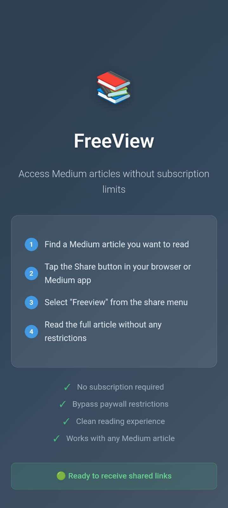
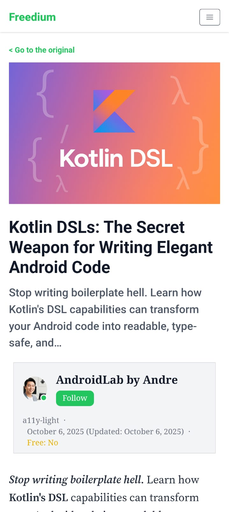

# FreeView — Unofficial Medium Reader for Android

A lightweight, ad-free Android app for reading Medium paywalled articles for free.
Share a Medium link to FreeView (or paste it in the app) and it opens the article
through the free reader service of your choice — no browser clutter, no login.

> **Disclaimer**
> Not affiliated with, endorsed by, or connected to Medium.com or any of the reader
> services listed below. FreeView hosts, scrapes, and modifies nothing — it simply
> opens publicly available pages in a WebView. Use responsibly and in line with the
> terms of Medium and whichever service you choose.

---

## Features

- **Multiple reader services** — pick whichever works best:
  Read-Medium · Freedium · Archive.today · Archive.is · Proxy API
- **Share or paste** — send a Medium link from any app, or paste it into the in-app URL bar
- **Reading history** — optionally keep your last 20 / 50 / 100 articles and reopen them with a tap
- **Settings** — reader service, theme (light / dark / system), article text size, and clear cache & cookies
- **Clean reader UI** — Material 3, collapsing top bar, edge-to-edge, full light & dark support
- Works on **Android 7.0 (API 24)** and higher

---

## How it works

1. Find a Medium article.
2. **Share** its link to FreeView — or open FreeView and **paste** the link into the top bar.
3. FreeView rewrites the link for your selected service and opens the full article.
4. Switch the service (and more) any time in **Settings**, and revisit past reads from **History**.

---

## Screenshots

| Home | Article |
|------|---------|
|  |  |

---

## Tech Stack

| Component     | Details                                       |
|---------------|-----------------------------------------------|
| Language      | Kotlin (JVM target 11)                        |
| Architecture  | Single-Activity, `ViewModel`-backed UI state  |
| UI            | Material 3 · ViewBinding · AndroidX Preference |
| Rendering     | Android WebView (nested-scroll enabled)       |
| Storage       | SharedPreferences (settings + history)        |
| Min / Target  | SDK 24 / 36                                    |
| Build         | Gradle Kotlin DSL + version catalog           |
| Tests         | JUnit (URL-builder unit tests)                |

---

## License

Released under the **MIT License**. © Rouf Syed

---

## Important Notes

- FreeView is a **client-side reader** — it does not scrape, modify, host, or store article content.
- It only opens publicly available pages through the third-party service you select.
- The availability of any given service, and the results it returns, are outside FreeView's control.
